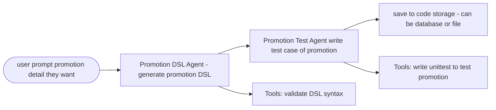
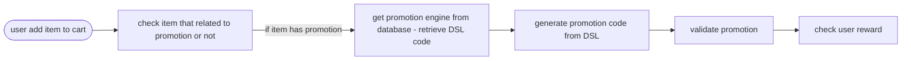

# Promotion DSL System Diagrams

## 1. Promotion DSL Authoring and Testing Flow

## 2. Promotion Engine Usage Flow

---

## Summary

These diagrams illustrate the workflow for both authoring/testing promotions using a DSL and the runtime flow for applying promotions in a shopping cart system:

- **Promotion DSL Authoring and Testing Flow:**
    - Users describe the promotion they want.
    - The Promotion DSL Agent generates the DSL code.
    - The Promotion Test Agent writes test cases for the promotion.
    - Tools are used to validate the DSL syntax and to write unittests.
    - The final DSL and tests are saved to code storage (database or file).

- **Promotion Engine Usage Flow:**
    - When a user adds an item to the cart, the system checks if the item is related to a promotion.
    - If so, it retrieves the promotion DSL code from storage.
    - The promotion code is generated and validated.
    - The system then checks and applies the appropriate user reward.
